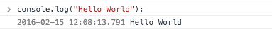

#JavaScript勉強会

***今日すること***
- 標準出力
- 変数
- 配列、オブジェクト
- ループ文
- 条件分岐
- 関数
- ライブラリの活用
- jQueryメソッド
- 様々なアルゴリズム

***

##標準出力をしてみよう

JavaScriptをかけるのは、html内のscriptタグの中、
.jsのファイルになります。


**index.html**
```html
<!DOCTYPE html>
<html>
  <head>
    <meta charset="utf-8">
    <title>JavaScript勉強会</title>
  </head>
  <body>
    <h1>Hello World</h1>
    <script type="text/javascript">
      console.log("Hello World");
    </script>
  </body>
</html>
```

**lesson.js**
```js
console.log("Hello World");
```

ブラウザにこのように表示されたでしょうか。


***
##変数

C言語でいう、`int`や`char`のような値を格納する変数がjsにもあります。

```c
int a = 0;
printf(%d,a);
```

jsでは、変数の宣言に`var`を使います。  
注意するべきは、`int`や`String`ではないということです。

**lesson.js**
```js
var msg = "Hello World";
console.log(msg);
```

***
##ネーミング規約

変数には必ず意味を持たせるとこ。
見やすい変数名を定義する。


`hal osaka`という変数をつけたいとします。
ネーミングをする際に、種類があるのでそれも見ていきましょう。

- halosaka (あまり好ましくない)
- hal-osaka (チェーン型 `css`)
- hal_osaka (アンダースコア型 `ファイル名`)
- halOsaka (キャメル型 `js`)


***
チェーン型は、cssのセレクタなどによく使われます。
`nav-top`,`nav-bottom`のように、1つ目に同じセレクタ、２つ目に場所などを指す書き方があり、*「BEM」* と呼びます。
***
アンダースコア型は、ファイル名や自分で作った関数、変数などに使われることがあります。
***
キャメル型は、javascriptの変数名などでよく使われていて、最初は小文字から始まり、つなぐ部分だけ大文字にしてつなぐのがキャメル型です。


***

##配列
javascriptで配列を作るのは簡単で、

```js
var colors = ["red","green","pink"];
```

のように作ります。
色を管理する配列を作ってみました。
`var`で変数(`colors`)を定義してその変数に`[]`で囲んだデータをそのまま挿入すれば`colors`は配列を持った変数になります。
配列は英語で`Array`というので、変数名を`colorsArray`としても良いと思います。

要素を取り出すときは

```js
console.log(colors[0]);
```

のように、今まで通り、取り出すことができます。

##オブジェクト

オブジェクトはjavascriptにとって、とても重要なのでじっくり解説していきます。

オブジェクトとは、javaで言うハッシュマップです。
作りかたは

```js
var tanaka = {
  name: "Tanaka",
  score: 100
}
```

のように書きます。
`var`で`tanaka`という変数を定義して、`{}`で囲ったものを挿入します。
この中で、`name`や`score`がありますが、これは`key`と言われるもので、この`key`を使って`value(値)`を取得します。

値の取り出し方は簡単です。
```js
console.log(tanaka["name"]);
// or
console.log(tanaka.name);
```

と、書きます。
`tanaka`に対して、`[]`で囲って呼ぶこともできますが、javascriptでは後者の`.`で繋いだ書き方が一般的です。

さらに、この`key`に対して、関数を定義することもできます。

```js
var tanaka = {
  name: "Tanaka",
  score: 100,
  sayHello: function(){
    console.log("Hello");
  }
}
```

こうすると、`tanaka.sayHello()`とするだけで、`Hello`と表示することができます。

この場合の`sayHello`は`key`でもありますが、値に関数が来た場合、`method(メソッド)`と呼びます。

メソッドに、例えば、`score`の`100`を使いたい時があります。
この場合に使えるのが、`this`です。
点数を返す、`sayScoreメソッド`を定義してみます。

```js
var tanaka = {
  name: "Tanaka",
  score: 100,
  sayScore: function(){
    console.log(this.score);
  }
}
```

これで、`100`と出ると思います。  
`this`は`var tanaka`を指します。つまり、自分自身を指します。
`this.score`は`tanaka.score`を同じなので、`100`が出るということです。

##ループ文

ループ文は`for`と`while`があります、`map`や`each`も出てきますが、特殊なので割愛。

###for
forの書き方は、

```js
for(var i = 0; i < 10; i++){
  console.log(i+"回目");
}
```

のように、書きます。

同じ処理を`while`で書き直しましょう。

###while

```js
var i = 0;
while(i<10){
 console.log(i+"回目");
 i++;
}
```

CやJavaとなんら変わりません。

変わっているfor文に、`in`というのがあります。
オブジェクトの中身をループさせる書き方があり、
```js
var price = {apple: 100,grape: 200, banana: 80};
for (var key in price) {
  console.log(price[key]);
}
```
のように、書きます。  
`in`なら`key`にそのオブジェクトの`key`が、代入されます。
この場合は、ループの中なので、`price.key`の書き方ができないことに、注意しないといけません。
##条件分岐

###if
if文も変わりません。

```js
var score = 80;
if(score >= 60){
  console.log("合格！");
}else{
  console.log("不合格！");
}
```

のように書きます。

if文には書き方がもう一つあり、**三項演算子を使った書き方** と言います。

```js
var score = 80;
score >= 80 ? console.log("合格") : console.log("不合格");
```

のように1行で書き換えることができます。
最初は見慣れないですが、なんだこれ。とならないように覚えておきましょう！
###switch

switchも他の言語と同じような書き方ができます。
信号機のswitch文を作りたいと思います。

```js
var signal = "red";
switch (signal) {
  case "red":
    console.log("STOP!");
    break;
  case "blue","green":
    console.log("GO!");
    break;
  case "yellow":
    console.log("soso...");
    break;
  default:
    console.log("Error");
}
```

このように他の言語と変わりなく書くことができます。

##関数

javascriptにおいて、関数は複数の種類あります。

- 普通関数
- 無名関数
- 即時関数

まず、**普通関数** の定義。

```js
function Hello(){
  console.log("Hello");
}
// or
var Hello = function(){
  console.log("Hello");
};
```

この2つの違いは、普通に関数を定義するか、変数`Hello`に関数を代入するかの差です。
後者の書き方は、式になるので、セミコロンが必要ですが、前者は特に必要ではありません。

次に **無名関数**
無名関数は、その名の通り名前のない関数です。

```js
function(){
  console.log("Hello");
}
```

このままでは関数を呼ぶことができません。
使い道は、後で出てくるコールバック関数などが、この書き方になります。
ここで例を出すと、`setTimeout`という関数がjavascriptで定義されていて、`指定ミリ秒後に処理をする`という関数です。
書き方は

```js
setTimeout(function(){
  console.log("Hello");
},1000);
```

これで、1000ミリ秒後＝１秒後にhelloと出力されます。
ここで、出てきた

```js
function(){
  console.log("Hello");
}
```

がそのまま、無名関数です。

**即時関数**

即時関数は、関数は普段、定義した後にコールの処理を書いて、呼びます。

```js
function hello(){
  console.log("Hello"); //関数の定義
}
hello(); // コール
```

これを一緒にするのが即時関数です。

```js
(function(){
  console.log("Hello");
})();
```

`()`で囲みます。
最後の`()`にはその関数に対する引数を入れることができます。

これの便利なところは、関数の中なので、`var`で変数を宣言していると、関数の外からはその値にアクセスできない。という点です。(ローカル変数,変数のスコープ)


##JSライブラリ

JavaScriptには、複雑なアルゴリズムを考えないとできないことを誰かが作ってくれて、それをみんな使える「ライブラリ」というものにしてくれている人がいます。
jQueryもその一種です。

jQueryの導入には
[jQuery使ってみない？](http://qiita.com/konojunya/items/1f442c8c09f128288c0e)
を参考にしていきたいと思います。

##jQueryメソッド

jQueryには、jQueryの中で、作ってくれているメソッドがいくつかあります。

- fade
- animate
- on

を見ていきましょう。

1. fade

fadeは、`fadeIn`、`fadeOut`というメソッドがあります。
使い方は簡単で、フェードイン、アウトしたい要素に`.fadeIn,Out`をつけるだけです。

```js
$(".hoge").fadeIn();
$(".hoge").fadeOut();
```

詳しく見ると、時間をかけて  
`display: none;`->`display: block;`  
の処理をしているだけです。


2. animate

時間をかけてアニメーションしながら要素を操作したい時に書きます。  
ゆっくり、widthを100%にする処理を書いてみましょう。  
元のcssのwidthが80%だとして

```css
.hoge{
  width: 80%;
  margin: 0 auto;
}
```

```js
$(".hoge").animate({
  width: "100%"
},1000);
```

のように書きます。
1秒かけて、`.hoge`を`width: 100%`にするjsです。

3. on

onは監視を意味します。
hover,click,scrollなどの動作は、`event`というのが発生します。その`event`が発生したのを察知して処理をしてくれます。
例えば、`.btn`をクリックしたら`.hoge`を出したいとすると

```js
$(".btn").on("click",function(){
  $(".hoge").fadeIn();
});
```

のようにかけます。
onは関数なので、第一引数に「なんのeventを監視するのか」、コールバック関数に処理。という流れになります。

##様々なアルゴリズム

これまで勉強したことを使って、サイトを作ってみましょう！
